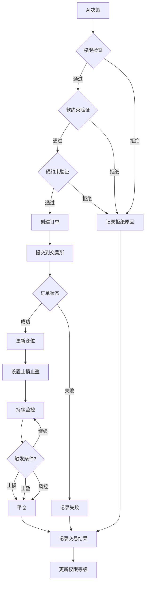

# 🔄 AIcoin 交易系统文档

> **完整交易系统技术说明** | v4.1 | 2025-11-15

---

## 📋 目录

1. [系统概述](#1-系统概述)
2. [交易流程](#2-交易流程)
3. [核心模块](#3-核心模块)
4. [数据模型](#4-数据模型)
5. [API接口](#5-api接口)
6. [风控机制](#6-风控机制)

---

## 1. 系统概述

### 1.1 交易系统架构

```
AI决策引擎
    ↓
交易决策验证
    ↓
┌─────────────┐
│ 交易管理器  │
│ TradeManager│
└──────┬──────┘
       │
       ├─→ 订单管理 (OrderManager)
       ├─→ 仓位管理 (PositionManager)
       ├─→ 风控管理 (RiskManager)
       └─→ 交易所适配器 (ExchangeAdapter)
              ↓
         Hyperliquid API
```

### 1.2 核心组件

| 组件 | 文件路径 | 职责 |
|------|---------|------|
| **交易管理器** | `backend/app/services/trading/trade_manager.py` | 交易流程协调 |
| **订单管理器** | `backend/app/services/trading/order_manager.py` | 订单生命周期管理 |
| **仓位管理器** | `backend/app/services/trading/position_manager.py` | 仓位跟踪和管理 |
| **风控管理器** | `backend/app/services/risk/risk_manager.py` | 风险控制 |
| **交易所适配器** | `backend/app/services/exchange/` | 交易所API封装 |

---

## 2. 交易流程

### 2.1 完整交易流程



### 2.2 关键步骤说明

#### 步骤 1: AI 决策
- AI 生成交易信号
- 包含：方向(多/空)、币种、置信度、止损止盈

#### 步骤 2: 权限检查
- 检查当前权限等级 (L0-L5)
- L0 直接拒绝
- 检查日交易次数限制

#### 步骤 3: 软约束验证
- 置信度是否达标
- 仓位大小是否合理
- 交易频率是否过高

#### 步骤 4: 硬约束验证
- 8 项红线检查
- 保证金率、回撤、杠杆等

#### 步骤 5: 订单执行
- 计算仓位大小
- 提交订单到交易所
- 等待成交确认

#### 步骤 6: 仓位管理
- 记录持仓信息
- 设置止损止盈订单
- 开始实时监控

#### 步骤 7: 持续监控
- 监控价格变化
- 检查止损止盈触发
- 检查风控条件

#### 步骤 8: 平仓
- 触发条件时自动平仓
- 记录交易结果
- 更新账户状态

---

## 3. 核心模块

### 3.1 交易管理器 (TradeManager)

**文件**: `backend/app/services/trading/trade_manager.py`

**核心方法**:

```python
class TradeManager:
    """交易管理器 - 协调整个交易流程"""
    
    async def execute_trade(
        self,
        decision: TradingDecision
    ) -> TradeResult:
        """
        执行交易
        
        Args:
            decision: AI决策结果
            
        Returns:
            TradeResult: 交易结果
        """
        # 1. 权限检查
        if not await self.check_permission():
            return TradeResult(status="rejected", reason="权限不足")
        
        # 2. 软约束验证
        if not await self.validate_soft_constraints(decision):
            return TradeResult(status="rejected", reason="软约束不通过")
        
        # 3. 硬约束验证
        if not await self.validate_hard_constraints(decision):
            return TradeResult(status="rejected", reason="硬约束不通过")
        
        # 4. 创建订单
        order = await self.order_manager.create_order(decision)
        
        # 5. 提交到交易所
        result = await self.exchange.submit_order(order)
        
        # 6. 更新仓位
        if result.success:
            await self.position_manager.update_position(result)
            await self.set_stop_loss_take_profit(result)
        
        # 7. 记录结果
        await self.record_trade(result)
        
        return result
```

---

### 3.2 订单管理器 (OrderManager)

**文件**: `backend/app/services/trading/order_manager.py`

**核心功能**:

```python
class OrderManager:
    """订单管理器 - 管理订单生命周期"""
    
    async def create_order(
        self,
        decision: TradingDecision
    ) -> Order:
        """创建订单"""
        # 计算仓位大小
        position_size = self.calculate_position_size(decision)
        
        # 创建订单对象
        order = Order(
            symbol=decision.symbol,
            side=decision.side,  # "buy" or "sell"
            size=position_size,
            leverage=decision.leverage,
            stop_loss=decision.stop_loss,
            take_profit=decision.take_profit
        )
        
        return order
    
    async def get_order_status(self, order_id: str) -> OrderStatus:
        """查询订单状态"""
        return await self.exchange.get_order(order_id)
    
    async def cancel_order(self, order_id: str) -> bool:
        """取消订单"""
        return await self.exchange.cancel_order(order_id)
```

**订单状态**:
- `pending`: 待提交
- `submitted`: 已提交
- `filled`: 已成交
- `partially_filled`: 部分成交
- `cancelled`: 已取消
- `failed`: 失败

---

### 3.3 仓位管理器 (PositionManager)

**文件**: `backend/app/services/trading/position_manager.py`

**核心功能**:

```python
class PositionManager:
    """仓位管理器 - 跟踪和管理持仓"""
    
    async def get_current_positions(self) -> List[Position]:
        """获取当前所有持仓"""
        return await self.db.query(Position).filter(
            Position.status == "open"
        ).all()
    
    async def update_position(self, trade_result: TradeResult):
        """更新仓位信息"""
        position = await self.get_or_create_position(
            trade_result.symbol
        )
        
        if trade_result.side == "buy":
            position.size += trade_result.size
        else:
            position.size -= trade_result.size
        
        position.entry_price = self.calculate_avg_price(position)
        position.unrealized_pnl = self.calculate_pnl(position)
        
        await self.db.commit()
    
    async def close_position(
        self,
        symbol: str,
        reason: str
    ) -> CloseResult:
        """平仓"""
        position = await self.get_position(symbol)
        
        # 创建平仓订单
        close_order = Order(
            symbol=symbol,
            side="sell" if position.side == "long" else "buy",
            size=position.size,
            order_type="market"
        )
        
        # 执行平仓
        result = await self.exchange.submit_order(close_order)
        
        # 记录结果
        position.status = "closed"
        position.close_price = result.price
        position.realized_pnl = self.calculate_realized_pnl(position)
        position.close_reason = reason
        
        await self.db.commit()
        
        return result
```

---

### 3.4 风控管理器 (RiskManager)

**文件**: `backend/app/services/risk/risk_manager.py`

**核心功能**:

```python
class RiskManager:
    """风控管理器 - 实时风险监控"""
    
    async def check_hard_constraints(self) -> Dict[str, bool]:
        """检查硬约束"""
        account = await self.get_account_info()
        
        checks = {
            "保证金率": account.margin_ratio >= 0.20,
            "总回撤": account.drawdown < 0.15,
            "单日亏损": account.daily_loss < 0.05,
            "杠杆限制": account.leverage <= 2,
            "现金储备": account.cash_reserve >= 0.10,
            "单资产敞口": self.check_single_asset_exposure(),
            "单笔亏损": self.check_single_trade_loss(),
        }
        
        return checks
    
    async def monitor_positions(self):
        """持续监控仓位"""
        while True:
            positions = await self.position_manager.get_current_positions()
            
            for position in positions:
                # 检查止损
                if self.should_stop_loss(position):
                    await self.position_manager.close_position(
                        position.symbol,
                        reason="止损"
                    )
                
                # 检查止盈
                if self.should_take_profit(position):
                    await self.position_manager.close_position(
                        position.symbol,
                        reason="止盈"
                    )
                
                # 检查风控
                if self.should_force_close(position):
                    await self.position_manager.close_position(
                        position.symbol,
                        reason="风控强制平仓"
                    )
            
            await asyncio.sleep(1)  # 每秒检查一次
```

---

### 3.5 交易所适配器 (ExchangeAdapter)

**文件**: `backend/app/services/exchange/hyperliquid_adapter.py`

**核心功能**:

```python
class HyperliquidAdapter(BaseExchangeAdapter):
    """Hyperliquid 交易所适配器"""
    
    async def submit_order(self, order: Order) -> OrderResult:
        """提交订单"""
        try:
            # 构建订单参数
            params = {
                "coin": order.symbol,
                "is_buy": order.side == "buy",
                "sz": order.size,
                "limit_px": order.price,
                "order_type": {"limit": {"tif": "Gtc"}},
                "reduce_only": False
            }
            
            # 提交到 Hyperliquid
            response = await self.client.order(params)
            
            # 解析结果
            return OrderResult(
                success=True,
                order_id=response["data"]["statuses"][0]["resting"]["oid"],
                price=float(response["data"]["statuses"][0]["filled"]["avgPx"]),
                size=order.size
            )
            
        except Exception as e:
            logger.error(f"订单提交失败: {e}")
            return OrderResult(success=False, error=str(e))
    
    async def get_balance(self) -> Dict:
        """获取账户余额"""
        response = await self.client.user_state(self.wallet_address)
        return {
            "total": float(response["marginSummary"]["accountValue"]),
            "available": float(response["marginSummary"]["totalMarginUsed"]),
            "margin_ratio": float(response["marginSummary"]["marginUsed"])
        }
    
    async def get_positions(self) -> List[Position]:
        """获取当前持仓"""
        response = await self.client.user_state(self.wallet_address)
        positions = []
        
        for pos in response["assetPositions"]:
            if float(pos["position"]["szi"]) != 0:
                positions.append(Position(
                    symbol=pos["position"]["coin"],
                    size=abs(float(pos["position"]["szi"])),
                    side="long" if float(pos["position"]["szi"]) > 0 else "short",
                    entry_price=float(pos["position"]["entryPx"]),
                    unrealized_pnl=float(pos["position"]["unrealizedPnl"])
                ))
        
        return positions
```

---

## 4. 数据模型

### 4.1 交易记录 (Trade)

**表名**: `trades`

```python
class Trade(Base):
    __tablename__ = "trades"
    
    id = Column(Integer, primary_key=True)
    user_id = Column(Integer, ForeignKey("users.id"))
    
    # 交易信息
    symbol = Column(String(20))  # BTC, ETH, SOL
    side = Column(String(10))    # long, short
    size = Column(Float)         # 仓位大小
    leverage = Column(Integer)   # 杠杆倍数
    
    # 价格信息
    entry_price = Column(Float)  # 开仓价格
    exit_price = Column(Float)   # 平仓价格
    stop_loss = Column(Float)    # 止损价格
    take_profit = Column(Float)  # 止盈价格
    
    # 结果信息
    pnl = Column(Float)          # 盈亏金额
    pnl_pct = Column(Float)      # 盈亏百分比
    fee = Column(Float)          # 手续费
    
    # 状态信息
    status = Column(String(20))  # open, closed
    close_reason = Column(String(50))  # 平仓原因
    
    # 时间信息
    created_at = Column(DateTime, default=datetime.utcnow)
    closed_at = Column(DateTime)
    
    # AI 决策信息
    decision_id = Column(Integer, ForeignKey("decision_history.id"))
    confidence = Column(Float)   # AI 置信度
    
    # 权限信息
    permission_level = Column(String(10))  # L0-L5
```

### 4.2 持仓信息 (Position)

**表名**: `positions`

```python
class Position(Base):
    __tablename__ = "positions"
    
    id = Column(Integer, primary_key=True)
    user_id = Column(Integer, ForeignKey("users.id"))
    
    # 持仓信息
    symbol = Column(String(20))
    side = Column(String(10))    # long, short
    size = Column(Float)         # 持仓数量
    leverage = Column(Integer)
    
    # 价格信息
    entry_price = Column(Float)  # 平均开仓价
    current_price = Column(Float)  # 当前价格
    liquidation_price = Column(Float)  # 强平价格
    
    # 盈亏信息
    unrealized_pnl = Column(Float)  # 未实现盈亏
    realized_pnl = Column(Float)    # 已实现盈亏
    
    # 风控信息
    stop_loss = Column(Float)
    take_profit = Column(Float)
    margin_ratio = Column(Float)  # 保证金率
    
    # 状态
    status = Column(String(20))  # open, closed
    
    # 时间
    opened_at = Column(DateTime, default=datetime.utcnow)
    updated_at = Column(DateTime, onupdate=datetime.utcnow)
    closed_at = Column(DateTime)
```

### 4.3 订单信息 (Order)

**表名**: `orders`

```python
class Order(Base):
    __tablename__ = "orders"
    
    id = Column(Integer, primary_key=True)
    user_id = Column(Integer, ForeignKey("users.id"))
    trade_id = Column(Integer, ForeignKey("trades.id"))
    
    # 订单信息
    order_id = Column(String(100))  # 交易所订单ID
    symbol = Column(String(20))
    side = Column(String(10))  # buy, sell
    order_type = Column(String(20))  # market, limit
    
    # 数量和价格
    size = Column(Float)
    price = Column(Float)
    filled_size = Column(Float)  # 已成交数量
    avg_price = Column(Float)    # 平均成交价
    
    # 状态
    status = Column(String(20))  # pending, filled, cancelled
    
    # 时间
    created_at = Column(DateTime, default=datetime.utcnow)
    filled_at = Column(DateTime)
    
    # 错误信息
    error_message = Column(Text)
```

---

## 5. API接口

### 5.1 交易执行接口

#### POST /api/v1/trades/execute
执行交易

**请求**:
```json
{
  "symbol": "BTC",
  "side": "long",
  "size": 0.1,
  "leverage": 2,
  "stop_loss": 0.03,
  "take_profit": 0.05,
  "confidence": 0.85
}
```

**响应**:
```json
{
  "success": true,
  "trade_id": 12345,
  "order_id": "abc123",
  "entry_price": 50000.0,
  "message": "交易执行成功"
}
```

### 5.2 查询接口

#### GET /api/v1/trades/current
获取当前交易

#### GET /api/v1/positions/current
获取当前持仓

#### GET /api/v1/trades/history
获取历史交易

**参数**:
- `start_date`: 开始日期
- `end_date`: 结束日期
- `symbol`: 币种筛选
- `status`: 状态筛选

### 5.3 管理接口

#### POST /api/v1/positions/close/{symbol}
平仓指定币种

#### POST /api/v1/positions/close-all
平掉所有仓位

#### PUT /api/v1/trades/{trade_id}/stop-loss
修改止损价格

#### PUT /api/v1/trades/{trade_id}/take-profit
修改止盈价格

---

## 6. 风控机制

### 6.1 八项硬约束

```python
HARD_CONSTRAINTS = {
    "保证金率": {
        "threshold": 0.20,
        "action": "拒绝交易",
        "description": "保证金率必须 ≥ 20%"
    },
    "总回撤": {
        "threshold": 0.15,
        "action": "强制平仓",
        "description": "总回撤超过 15% 强制平仓"
    },
    "单日亏损": {
        "threshold": 0.05,
        "action": "停止交易",
        "description": "单日亏损超过 5% 停止交易"
    },
    "杠杆限制": {
        "threshold": 2,
        "action": "拒绝交易",
        "description": "杠杆不得超过 2 倍"
    },
    "现金储备": {
        "threshold": 0.10,
        "action": "拒绝交易",
        "description": "至少保留 10% 现金"
    },
    "单资产敞口": {
        "threshold": 0.10,
        "action": "拒绝交易",
        "description": "单个币种不超过 10%"
    },
    "单笔亏损": {
        "threshold": 0.05,
        "action": "拒绝交易",
        "description": "单笔亏损不超过 5%"
    },
    "强制平仓": {
        "threshold": 0.15,
        "action": "强制平仓",
        "description": "15% 回撤强制平仓"
    }
}
```

### 6.2 实时监控

**监控频率**: 每秒检查一次

**监控内容**:
- 账户余额变化
- 持仓盈亏变化
- 保证金率变化
- 回撤水平
- 止损止盈触发

**触发动作**:
- 告警通知
- 自动平仓
- 降低权限等级
- 停止交易

---

## 📚 相关文档

- [系统架构](./01-系统架构.md) - 整体架构说明
- [API接口](./02-API接口/) - API详细文档
- [用户指南](../01-用户指南/01-用户指南.md) - 交易规则说明
- [风控策略](./05-研究报告/09-风控策略研究.md) - 风控策略研究

---

**文档维护**: AIcoin Team  
**最后更新**: 2025-11-15  
**文档版本**: v1.0

