# 🏗️ AIcoin 系统架构设计

> **版本**: v2.0 | **状态**: Active | **更新**: 2025-10-31

---

## 📋 目录

1. [整体架构](#整体架构)
2. [核心模块](#核心模块)
3. [数据流转](#数据流转)
4. [技术选型](#技术选型)
5. [部署架构](#部署架构)

---

## 1. 整体架构

### 1.1 分层架构图

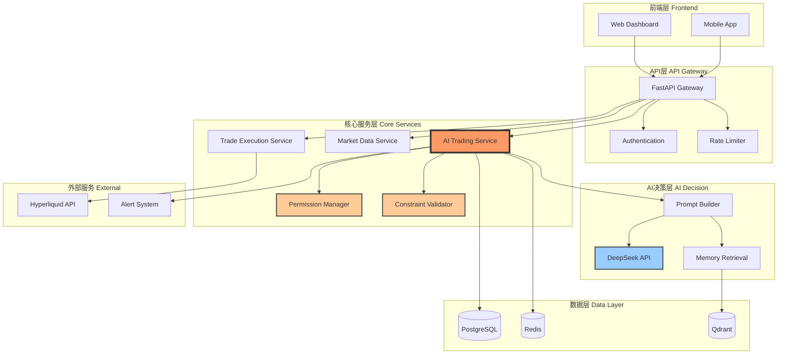

---

## 2. 核心模块

### 2.1 AI Trading Service（核心大脑）

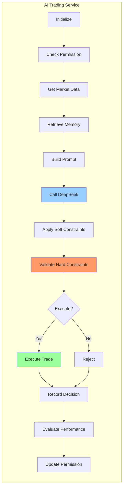

**职责**：
- 协调所有AI交易流程
- 整合权限、约束、记忆系统
- 执行交易决策
- 记录和评估

---

### 2.2 Permission Manager（权限管理）

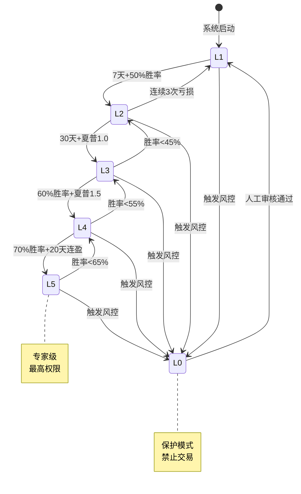

**职责**：
- 动态评估AI表现
- 自动升降权限等级
- 提供权限配置给决策流程

---

### 2.3 Constraint Validator（约束验证）

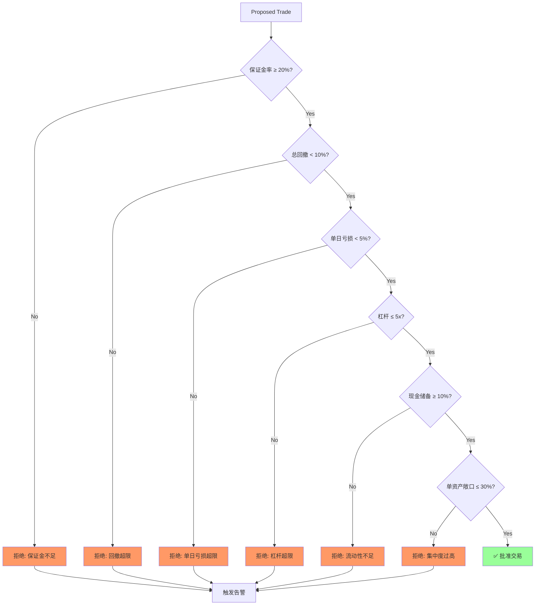

**职责**：
- 验证所有硬性约束
- 拒绝违规交易
- 触发风控告警

---

### 2.4 Memory System（三层记忆）

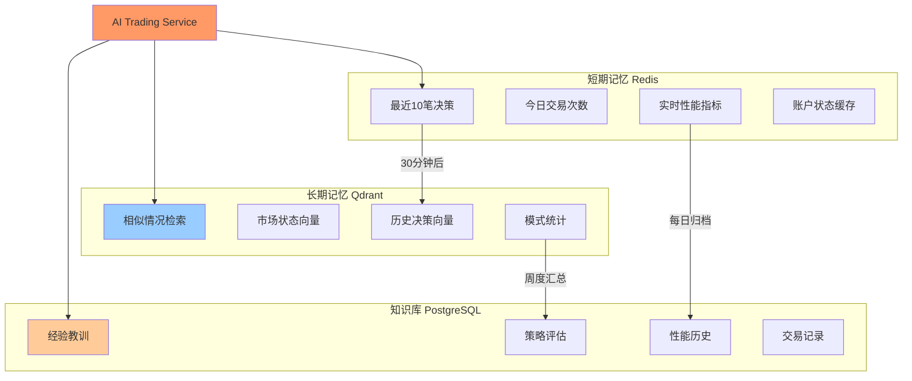

**职责**：
- 短期：快速访问最近数据（Redis）
- 长期：向量相似度检索（Qdrant）
- 知识：结构化经验教训（PostgreSQL）

---

## 3. 数据流转

### 3.1 完整决策流程

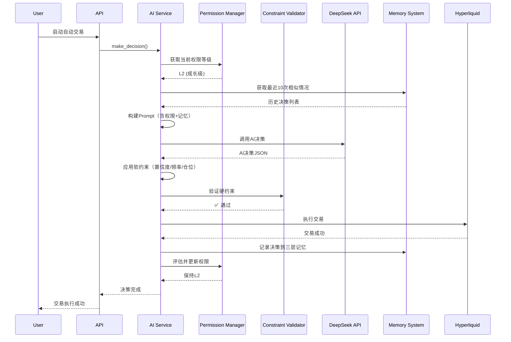

---

### 3.2 风控触发流程

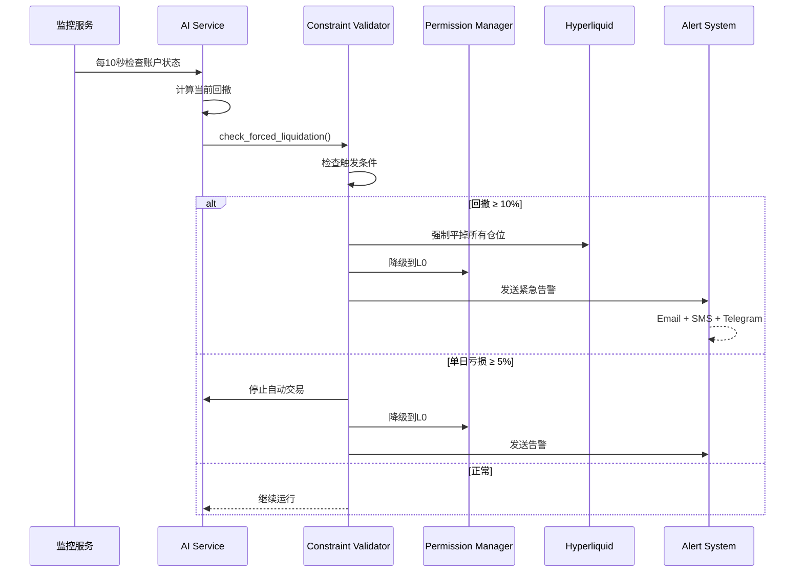

---

## 4. 技术选型

### 4.1 技术栈总览

| 层次 | 技术 | 选型理由 |
|------|------|---------|
| **前端** | Next.js 14 + React 18 | SSR + 现代React |
| **API** | FastAPI | 高性能 + 异步 + 自动文档 |
| **AI** | DeepSeek V3.1 | 性价比高 + 中文友好 |
| **数据库** | PostgreSQL 15 | 可靠 + JSON支持 |
| **缓存** | Redis 7 | 快速 + 数据结构丰富 |
| **向量库** | Qdrant | Rust高性能 + Docker部署简单 |
| **交易所** | Hyperliquid | 去中心化 + API完善 |

### 4.2 关键库依赖

**后端 Python**:
```python
fastapi==0.104.1
sqlalchemy==2.0.23
redis==5.0.1
qdrant-client==1.7.0
hyperliquid-python-sdk==0.3.0
openai==1.3.5  # for DeepSeek
pydantic==2.5.0
celery==5.3.4
```

**前端 TypeScript**:
```json
{
  "next": "14.0.3",
  "react": "18.2.0",
  "tailwindcss": "3.3.5",
  "lightweight-charts": "4.1.0",
  "axios": "1.6.2"
}
```

---

## 5. 部署架构

### 5.1 Docker Compose 架构

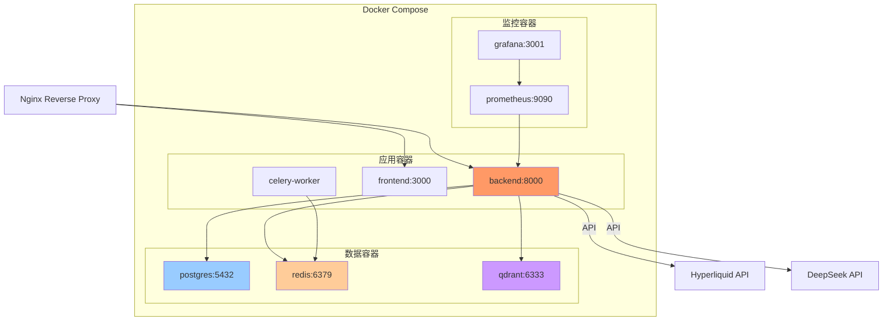

### 5.2 生产环境部署

**阿里云 ECS 推荐配置**：

| 组件 | 规格 | 说明 |
|------|------|------|
| **ECS** | 4C8G | 运行Docker Compose |
| **磁盘** | 100GB SSD | 存储数据库和日志 |
| **网络** | 5Mbps | 足够API调用 |
| **PostgreSQL** | RDS基础版 | 或自建在ECS |
| **Redis** | 云数据库Redis | 或自建在ECS |

**Phase 1-2**: 单机Docker Compose部署  
**Phase 3**: 考虑微服务拆分（Kubernetes）

### 5.3 监控告警

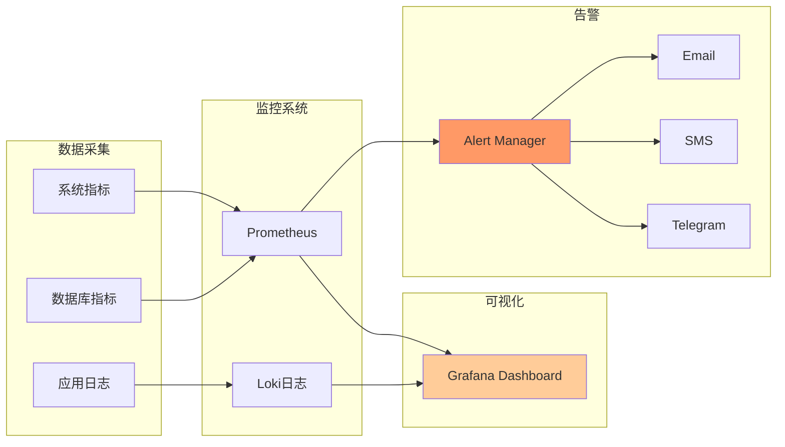

---

## 6. 性能指标

### 6.1 系统性能目标

| 指标 | 目标值 | 说明 |
|------|--------|------|
| **AI决策延迟** | < 5秒 | 从数据获取到决策完成 |
| **交易执行延迟** | < 2秒 | 从决策到订单提交 |
| **API响应时间** | < 200ms | 95分位 |
| **数据库查询** | < 50ms | 95分位 |
| **Redis查询** | < 10ms | 99分位 |
| **向量检索** | < 500ms | Top 10相似度 |

### 6.2 可扩展性设计

**水平扩展能力**：
```
Phase 1-2: 单实例（100 QPS）
   ↓
Phase 3: 多实例 + 负载均衡（500 QPS）
   ↓
未来: K8s集群（5000+ QPS）
```

---

## 7. 安全设计

### 7.1 安全层级

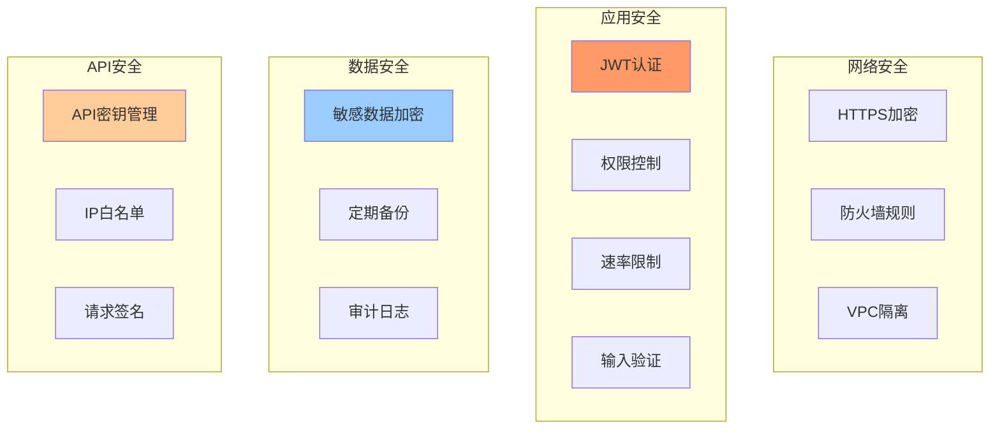

### 7.2 敏感信息保护

```python
# 环境变量管理
SENSITIVE_DATA = {
    "HYPERLIQUID_API_KEY": "环境变量",
    "HYPERLIQUID_SECRET_KEY": "环境变量",
    "DEEPSEEK_API_KEY": "环境变量",
    "DATABASE_PASSWORD": "环境变量 + 加密",
    "JWT_SECRET": "环境变量",
}

# 不在代码中硬编码
# 不提交到Git
# 使用.env文件（.gitignore）
```

---

## 8. 灾难恢复

### 8.1 备份策略

| 类型 | 频率 | 保留时间 | 存储位置 |
|------|------|---------|---------|
| **数据库** | 每日 | 30天 | 阿里云OSS |
| **配置文件** | 每次修改 | 永久 | Git |
| **交易日志** | 实时 | 90天 | 本地+OSS |
| **系统快照** | 每周 | 4周 | ECS快照 |

### 8.2 故障恢复流程

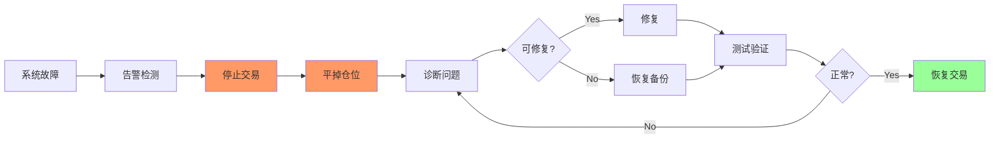

---

## 9. 开发与部署

### 9.1 开发环境

```bash
# 1. 克隆代码
git clone https://github.com/allenxing4071/aicoin.git
cd aicoin

# 2. 配置环境变量
cp .env.example .env
# 编辑.env填入API密钥

# 3. 启动开发环境
docker-compose -f docker-compose.dev.yml up -d

# 4. 访问
# Backend: http://localhost:8000/docs
# Frontend: http://localhost:3000
```

### 9.2 生产部署

```bash
# 1. 在阿里云ECS上
ssh user@your-server-ip

# 2. 安装Docker
curl -fsSL https://get.docker.com | sh

# 3. 部署应用
git clone https://github.com/allenxing4071/aicoin.git
cd aicoin
cp .env.production .env
# 填入生产环境配置

# 4. 启动
docker-compose up -d

# 5. 配置Nginx反向代理
# (参考nginx.conf)
```

---

## 📚 相关文档

- [智能约束框架](./01-智能约束框架.md) - 权限和约束系统
- [记忆学习系统](./02-记忆学习系统.md) - 三层记忆架构
- [自建模型方案](./03-自建模型方案.md) - Phase 3模型微调
- [监控评估系统](./04-监控评估系统.md) - KPI和监控

---

**文档版本**: v2.0  
**最后更新**: 2025-10-31  
**维护状态**: ✅ Active

