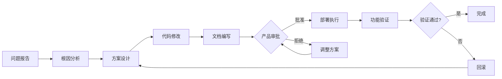

# 🔧 Redoc 页面修复 - 文档索引

> **问题**: `/redoc` 和 `/docs` 页面无法访问（404 错误）  
> **状态**: ✅ 修复完成，等待部署  
> **日期**: 2025-11-12

---

## 📚 快速导航

### 🎯 我是...

#### 产品经理
👉 **开始阅读**: [`问题修复总结-产品经理版.md`](./问题修复总结-产品经理版.md)

**你需要做什么**:
- 了解问题和影响范围
- 做出 3 个决策（是否修复、何时部署、访问权限）
- 批准或要求调整

**预计阅读时间**: 5 分钟

---

#### 运维/DevOps
👉 **开始阅读**: [`HOTFIX-REDOC-20251112.md`](./HOTFIX-REDOC-20251112.md)

**你需要做什么**:
```bash
# 就一行命令
sudo bash scripts/update-nginx-config.sh
```

**预计执行时间**: 1 分钟（自动化脚本）

**详细步骤**: [`DEPLOYMENT-CHECKLIST.md`](./DEPLOYMENT-CHECKLIST.md)

---

#### 技术负责人/架构师
👉 **开始阅读**: [`docs/故障修复-Redoc页面无法访问.md`](./docs/故障修复-Redoc页面无法访问.md)

**你需要知道**:
- 完整的技术根因分析
- Nginx location 匹配规则详解
- 修复方案的技术细节
- 经验总结和后续建议

**预计阅读时间**: 10-15 分钟

---

#### 项目管理/团队成员
👉 **开始阅读**: [`CHANGELOG-20251112.md`](./CHANGELOG-20251112.md)

**你会了解**:
- 这次更新改了什么
- 影响范围和风险评估
- 时间线和贡献者
- 后续建议

**预计阅读时间**: 5 分钟

---

## 📖 完整文档列表

| 文档 | 用途 | 目标读者 | 优先级 |
|------|------|----------|--------|
| **问题修复总结-产品经理版.md** | 决策参考 | 产品经理 | ⭐⭐⭐ |
| **HOTFIX-REDOC-20251112.md** | 快速修复 | 运维人员 | ⭐⭐⭐ |
| **DEPLOYMENT-CHECKLIST.md** | 部署清单 | 运维人员 | ⭐⭐ |
| **docs/故障修复-Redoc页面无法访问.md** | 技术分析 | 技术人员 | ⭐⭐ |
| **CHANGELOG-20251112.md** | 更新日志 | 所有人 | ⭐⭐ |
| **README-REDOC-FIX.md**（本文件） | 导航索引 | 所有人 | ⭐⭐⭐ |

---

## 🎬 修复流程



**当前进度**: 已完成 E（文档编写），等待 F（产品审批）

---

## 🚀 一键部署

### 对于运维人员

```bash
# 1. SSH 到服务器
ssh user@jifenpay.cc

# 2. 进入项目目录
cd /path/to/AIcoin

# 3. 拉取最新代码
git pull origin main

# 4. 执行自动化脚本（需要 sudo）
sudo bash scripts/update-nginx-config.sh

# 5. 验证
curl -I https://jifenpay.cc/docs
curl -I https://jifenpay.cc/redoc
```

**就这么简单！** 脚本会处理所有细节。

---

## ✅ 验证修复

### 浏览器测试
1. 打开 https://jifenpay.cc/docs - 应该看到 Swagger UI
2. 打开 https://jifenpay.cc/redoc - 应该看到 ReDoc

### 命令行测试
```bash
# 所有端点都应该返回 200 OK
curl -I https://jifenpay.cc/docs
curl -I https://jifenpay.cc/redoc
curl -I https://jifenpay.cc/openapi.json
```

---

## 🔄 如果出现问题

### 回滚（1分钟）
```bash
# 恢复备份（脚本会显示备份路径）
BACKUP_DIR="/var/backups/nginx-YYYYMMDD-HHMMSS"
docker cp $BACKUP_DIR/nginx.conf nginx:/etc/nginx/nginx.conf
docker exec nginx nginx -s reload
```

### 寻求帮助
1. 检查 Nginx 错误日志：`docker logs nginx | grep error`
2. 查看详细文档了解更多细节
3. 联系技术负责人

---

## 📊 影响评估速览

| 方面 | 影响 | 说明 |
|------|------|------|
| **普通用户** | ✅ 无影响 | 不使用 API 文档 |
| **开发者** | ✅ 修复功能 | 可以查看 API 文档 |
| **性能** | ✅ 无影响 | 只是路由规则 |
| **稳定性** | ✅ 无影响 | 热重载，不中断 |
| **安全性** | ✅ 无变化 | 保持现有设置 |
| **风险** | 🟢 极低 | 可快速回滚 |

---

## 🎯 修复摘要

### 问题
Nginx 配置错误，将 `/docs` 和 `/redoc` 转发到前端而非后端

### 解决
添加正则 location 规则，正确转发到后端

### 变更
- 3 个配置文件
- 1 个自动化脚本
- 5 个文档

### 时间
- 准备：✅ 完成
- 部署：10 分钟
- 验证：5 分钟

---

## 📞 联系信息

- **技术问题**: 项目 Issue 或内部沟通渠道
- **紧急问题**: 联系技术负责人
- **产品建议**: 联系产品经理

---

## 🏁 下一步

### 如果你是产品经理
1. 阅读 [`问题修复总结-产品经理版.md`](./问题修复总结-产品经理版.md)
2. 做出决策并批准（或提出调整意见）
3. 等待技术团队部署和验证

### 如果你是运维人员
1. 等待产品经理批准
2. 使用自动化脚本部署
3. 验证功能正常
4. 报告结果

### 如果你是技术人员
1. 可以深入阅读技术文档了解细节
2. 等待批准后协助部署
3. 持续监控系统状态

---

**最后更新**: 2025-11-12  
**维护者**: AI Assistant (Cursor)  
**状态**: 🟡 等待产品审批

---

*有问题？从上面的"快速导航"找到适合你角色的文档开始阅读！*

