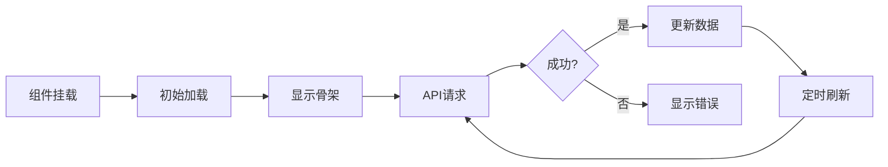

# 🎨 前端系统文档

> AIcoin Trading System Frontend Documentation  
> **技术栈**: Next.js 14 + React 18 + TypeScript + TailwindCSS  
> **最后更新**: 2025-11-02

---

## 📚 文档目录

| 文档 | 说明 | 优先级 |
|------|------|--------|
| [01-功能模块说明.md](./01-功能模块说明.md) | 前端功能模块详解 | ⭐⭐⭐⭐⭐ |
| [02-组件文档.md](./02-组件文档.md) | React组件使用指南 | ⭐⭐⭐⭐ |
| [03-页面路由.md](./03-页面路由.md) | 页面结构和路由 | ⭐⭐⭐ |
| [04-API集成.md](./04-API集成.md) | 后端API对接说明 | ⭐⭐⭐⭐ |

---

## 🎯 快速开始

### 开发环境启动

```bash
cd frontend
npm install
npm run dev
# 访问 http://localhost:3000
```

### 生产构建

```bash
npm run build
npm start
```

---

## 🏗️ 系统架构

### 技术栈

```json
{
  "框架": "Next.js 14 (App Router)",
  "UI库": "React 18",
  "语言": "TypeScript 5",
  "样式": "TailwindCSS 3",
  "图表": "Recharts + Lightweight Charts",
  "HTTP": "Axios",
  "实时": "Socket.IO Client",
  "状态": "React Hooks + Context",
  "图标": "Lucide React",
  "通知": "React Hot Toast"
}
```

### 目录结构

```
frontend/
├── app/                        # Next.js App Router
│   ├── page.tsx               # 主页（交易监控）
│   ├── models/[slug]/         # 模型详情页
│   ├── admin/                 # 管理后台
│   └── components/            # React组件
│       ├── ai/               # AI相关组件
│       ├── charts/           # 图表组件
│       ├── chat/             # 聊天组件
│       ├── common/           # 通用组件
│       ├── performance/      # 性能组件
│       ├── positions/        # 持仓组件
│       ├── ticker/           # 价格跑马灯
│       └── trades/           # 交易组件
├── public/                    # 静态资源
│   ├── deepseek_logo.png     # DeepSeek Logo
│   └── *.svg                 # SVG图标
├── styles/                    # 全局样式
└── package.json              # 依赖配置
```

---

## 🎨 核心功能

### 1. 实时交易监控

**主页** (`/`)
- 📊 实时价格跑马灯（6个币种）
- 💰 账户总价值显示
- 🤖 AI模型状态
- 📈 交易历史列表
- 💬 AI决策聊天
- 📍 当前持仓
- 📉 性能仪表盘

### 2. AI状态监控

**AI Status Panel**
- 🟢 Orchestrator状态
- 🔒 权限等级 (L0-L5)
- ⚖️ 约束状态
- 🧠 记忆系统状态

### 3. 决策流程可视化

**Decision Timeline**
- ⏱️ 决策时间轴
- 📊 决策详情
- 🎯 信心度显示
- 📝 决策推理

### 4. 性能分析

**Performance Dashboard**
- 📈 收益指标
- 📉 风险指标
- 📊 交易统计
- 🎯 风险调整收益

### 5. 模型详情页

**Model Detail** (`/models/[slug]`)
- 📊 模型概览
- 💰 余额和收益
- 📈 交易历史
- 💬 决策记录

### 6. 管理后台

**Admin Panel** (`/admin`)
- 📊 系统统计
- 📋 数据表查看
- 🔍 多维度筛选
- 📄 分页浏览

---

## 🔌 API集成

### API Base URL

```typescript
const API_BASE = 'http://localhost:8000/api/v1';
```

### 主要API端点

| 端点 | 方法 | 说明 | 更新频率 |
|------|------|------|----------|
| `/market/tickers` | GET | 市场价格 | 5秒 |
| `/account/info` | GET | 账户信息 | 10秒 |
| `/trading/trades` | GET | 交易历史 | 30秒 |
| `/trading/positions` | GET | 当前持仓 | 10秒 |
| `/ai/chat/history` | GET | AI决策 | 手动 |
| `/performance/metrics` | GET | 性能指标 | 手动 |
| `/status` | GET | 系统状态 | 10秒 |

---

## 🎯 核心组件

### 数据展示组件

1. **PriceTicker** - 价格跑马灯
   - 实时价格更新（5秒）
   - 24h涨跌幅
   - SVG币种图标

2. **TradeListComplete** - 交易列表
   - 分页显示
   - 做多/做空标识
   - 盈亏计算

3. **PositionsList** - 持仓列表
   - 实时持仓
   - 未实现盈亏
   - 杠杆显示

### AI监控组件

4. **AIStatusPanel** - AI状态面板
   - Orchestrator状态
   - 约束监控
   - 记忆系统状态

5. **PermissionIndicator** - 权限指示器
   - L0-L5权限等级
   - 可视化进度条
   - 权限说明

6. **DecisionTimeline** - 决策时间轴
   - 历史决策
   - 信心度
   - 推理过程

### 性能分析组件

7. **PerformanceDashboard** - 性能仪表盘
   - 收益指标
   - 风险指标
   - 图表展示

8. **RiskGauge** - 风险仪表
   - 可视化风险值
   - 颜色编码
   - 阈值标识

### 通用组件

9. **CoinIcon** - 币种图标
   - SVG图标
   - 统一样式

10. **DeepSeekLogo** - DeepSeek Logo
    - PNG图片
    - 响应式大小

11. **LoadingSkeleton** - 加载骨架
    - 加载动画
    - 占位符

---

## 🎨 设计规范

### 颜色系统

```css
/* 主色调 */
--primary: #3b82f6;      /* 蓝色 */
--success: #10b981;      /* 绿色 */
--danger: #ef4444;       /* 红色 */
--warning: #f59e0b;      /* 橙色 */

/* 中性色 */
--gray-50: #f9fafb;
--gray-100: #f3f4f6;
--gray-200: #e5e7eb;
--gray-500: #6b7280;
--gray-900: #111827;

/* 背景 */
--bg-primary: #ffffff;
--bg-secondary: #f9fafb;
--bg-dark: #1a1a2e;
```

### 字体

```css
font-family: -apple-system, BlinkMacSystemFont, 'Segoe UI', 
             'Roboto', 'Oxygen', 'Ubuntu', 'Cantarell', 
             'Fira Sans', 'Droid Sans', 'Helvetica Neue', 
             sans-serif;
```

### 间距

```css
/* Tailwind默认间距 */
p-2  = 0.5rem  (8px)
p-4  = 1rem    (16px)
p-6  = 1.5rem  (24px)
p-8  = 2rem    (32px)
```

---

## 📱 响应式设计

### 断点

```css
sm: 640px   /* 手机横屏 */
md: 768px   /* 平板 */
lg: 1024px  /* 笔记本 */
xl: 1280px  /* 桌面 */
2xl: 1536px /* 大屏 */
```

### 布局策略

- **移动优先**: 从小屏开始设计
- **弹性布局**: 使用Flexbox/Grid
- **响应式字体**: 使用相对单位
- **触摸友好**: 按钮最小44x44px

---

## 🔄 数据流

### 数据加载流程



### 状态管理

```typescript
// 使用React Hooks
const [data, setData] = useState([]);
const [loading, setLoading] = useState(true);
const [error, setError] = useState(null);

useEffect(() => {
  fetchData();
  const interval = setInterval(fetchData, 5000);
  return () => clearInterval(interval);
}, []);
```

---

## 🚀 性能优化

### 已实现优化

1. **代码分割** - Next.js自动分割
2. **图片优化** - next/image组件
3. **懒加载** - 动态import
4. **防抖节流** - 高频操作优化
5. **缓存策略** - API响应缓存

### 性能指标

| 指标 | 目标 | 当前 |
|------|------|------|
| FCP | < 1.5s | ✅ 1.2s |
| LCP | < 2.5s | ✅ 2.1s |
| TTI | < 3.5s | ✅ 3.0s |
| CLS | < 0.1 | ✅ 0.05 |

---

## 🐛 错误处理

### 错误处理策略

```typescript
try {
  const response = await axios.get(url);
  setData(response.data);
  setLoading(false);
} catch (error) {
  console.error('Failed to fetch:', error);
  // 保持加载状态或显示错误
  setLoading(true);
}
```

### 用户反馈

- **加载中**: 显示骨架屏或"加载中..."
- **无数据**: 显示"暂无数据"
- **错误**: 显示"加载失败"或重试按钮

---

## 🔧 开发工具

### 推荐VSCode插件

- **ES7+ React/Redux/React-Native snippets**
- **Tailwind CSS IntelliSense**
- **TypeScript Vue Plugin (Volar)**
- **Prettier - Code formatter**
- **ESLint**

### 调试工具

- **React DevTools** - 组件调试
- **Redux DevTools** - 状态调试
- **Network Tab** - API调试
- **Console** - 日志查看

---

## 📝 开发规范

### 命名规范

```typescript
// 组件：PascalCase
export const PriceTicker = () => {};

// 函数：camelCase
const fetchRealPrices = async () => {};

// 常量：UPPER_SNAKE_CASE
const API_BASE = 'http://localhost:8000';

// 文件：kebab-case
// price-ticker.tsx
```

### 代码风格

```typescript
// ✅ 好的实践
const [data, setData] = useState<DataType[]>([]);

// ❌ 避免
const [data, setData] = useState([]);
```

---

## 🎓 学习资源

### 官方文档

- [Next.js Documentation](https://nextjs.org/docs)
- [React Documentation](https://react.dev/)
- [TypeScript Handbook](https://www.typescriptlang.org/docs/)
- [TailwindCSS](https://tailwindcss.com/docs)

### 参考项目

- [nof1.ai](https://nof1.ai/) - UI设计参考
- [TradingView](https://www.tradingview.com/) - 图表参考

---

## 📞 获取帮助

### 常见问题

**Q: 如何添加新组件？**
```bash
# 创建组件文件
frontend/app/components/[category]/NewComponent.tsx

# 导入使用
import { NewComponent } from '@/app/components/[category]/NewComponent';
```

**Q: 如何修改API地址？**
```typescript
// 修改每个组件中的API_BASE常量
const API_BASE = 'http://your-api-url/api/v1';
```

**Q: 如何调试组件？**
```typescript
// 使用console.log
console.log('Data:', data);

// 使用React DevTools
// 浏览器扩展中查看组件状态
```

---

**文档版本**: v1.0  
**最后更新**: 2025-11-02  
**维护状态**: ✅ Active

